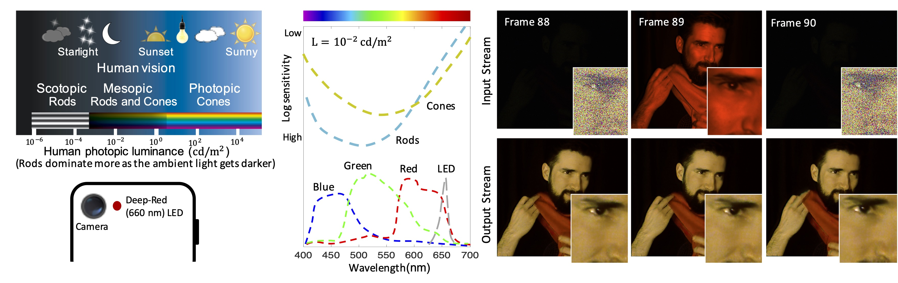

# Seeing in Extra Darkness Using a Deep-red Flash
This is the PyTorch code for 2021 CVPR paper "Seeing in Extra Darkness Using a Deep-red Flash"
### [Project Page](https://vccimaging.org/Publications/Xiong2021Seeing/) | [Paper](https://vccimaging.org/Publications/Xiong2021Seeing/Xiong2021Seeing.pdf)

[Seeing in Extra Darkness Using a Deep-red Flash](https://vccimaging.org/Publications/Xiong2021Seeing/Xiong2021Seeing.pdf)  
 [Jinhui Xiong](https://jhxiong.github.io/)<sup>1</sup>\*,
 [Jian Wang](https://jianwang-cmu.github.io/)<sup>2</sup>\*,
 [Wolfgang Heidrich](https://vccimaging.org/People/heidriw/bio)<sup>1</sup>,
 [Shree Nayar](http://www.cs.columbia.edu/~nayar/)<sup>2</sup> <br>
 <sup>1</sup>KAUST, <sup>2</sup>Snap Research
  \*denotes equal contribution  
CVPR 2021 (Oral)


<strong>Top left:</strong> Human vision uses cones and rods for the perception of light. Photopic vision is associated with cones, occurring at bright-light conditions (over 3 cd/m^2). Scotopic vision is associated with rods, occurring at dim-light conditions (below 10^{-3} cd/m^2). At intermediate light levels, both rods and cones are active, which is called mesopic vision. <br>
<strong>Bottom left:</strong> We propose to use deep-red (e.g. 660 nm) light as flash for low-light imaging in mesopic light levels. This new flash can be introduced into smartphones with a minor hardware adjustment. <br>
<strong>Middle:</strong> The eye spectral sensitivity in a dimly lit environment (0.01 cd/m^2) and the relative responses of R, G and B color channels of the camera we used, as well as the emissions spectrum of the red LED. Under dim lighting, rod vision dominates, yet the rods are nearly insensible to deep-red light. Meanwhile, our LED flash can be sensed by the camera especially in the red and green channels. <br>
<strong>Right:</strong> Inputs to our videography pipeline are a sequence of no-flash and flash frames, and the outputs are denoised and would yield temporally stable videos with no frame rate loss.

### Prerequisite
python>=3.7 & PyTorch>=1.3 & cuda>=10.0 <br>
Minor change on the code if there is compatibility issue.

## Image Filtering
To test image filtering on our data, we prepared a notebook
```
evaluate.ipynb
```
in the [image_filtering](https://github.com/vccimaging/Deep-Red-Flash/tree/main/image_filtering) folder.

## Video Filtering
Change directory to [video_filtering](https://github.com/vccimaging/Deep-Red-Flash/tree/main/video_filtering) folder.

You may download the data for [scene1](https://drive.google.com/uc?export=download&id=1_e2z7lqQY_FAVdgrVLLkaBjv6h7kCdE2) and [scene2](https://drive.google.com/uc?export=download&id=1R34WB0lplmCSHWQbvKY6sW3NDAS3g6Bn) for testing. Put the downloaded video in a newly created "input" folder.

To test video filtering, you need to first install [PWC-Net](https://github.com/NVlabs/PWC-Net/tree/master/PyTorch) for flow computation and [Temporal Consistency Network](https://github.com/phoenix104104/fast_blind_video_consistency) for enhancing tempotal consistency.

After installation, you need to correctly import them (sample code is commented) and run
```
python video_filtering.py
```
## Citation
```
@inproceedings{xiong2021seeing,
  title={Seeing in Extra Darkness Using a Deep-red Flash},
  author={Jinhui Xiong and Jian Wang and Wolfgang Heidrich and Shree Nayar},
  year={2021},
  booktitle={CVPR}
}
```
### Contact
Please contact Jinhui Xiong <jinhui.xiong@kaust.edu.sa> if you have any question or comment.
